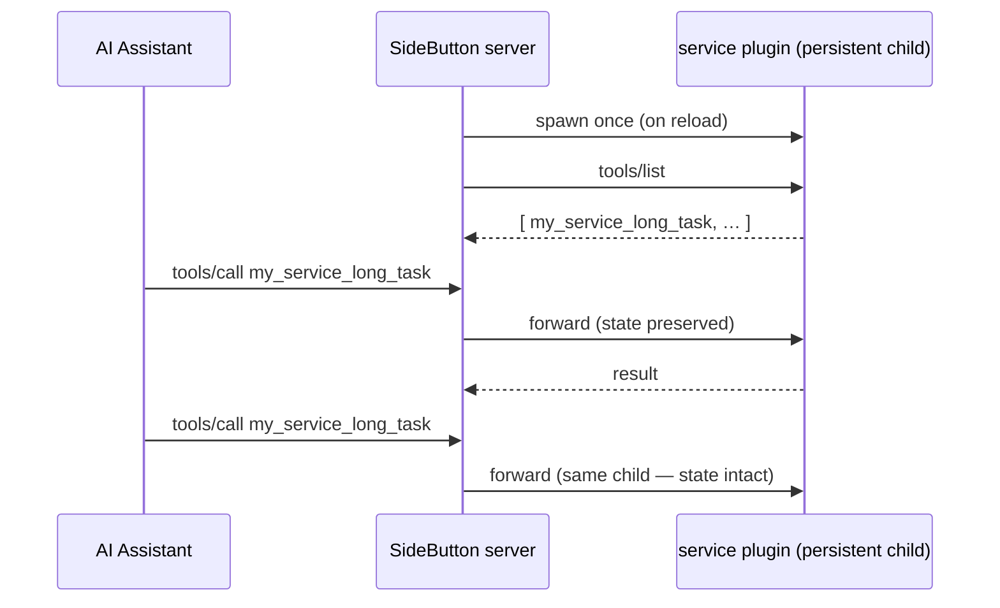

# Creating Plugins

Build a SideButton plugin that adds custom MCP tools. Plugins can be written in any language — bash, Node.js, Python, or anything that reads stdin and writes stdout.

## Quick Start

```bash
# Create plugin directory
mkdir -p ~/.sidebutton/plugins/hello
cd ~/.sidebutton/plugins/hello
```

Create `plugin.json`:

```json
{
  "name": "hello",
  "version": "1.0.0",
  "description": "Greeting plugin",
  "tools": [{
    "name": "hello_greet",
    "description": "Greet someone by name",
    "inputSchema": {
      "type": "object",
      "properties": { "name": { "type": "string" } },
      "required": ["name"]
    },
    "handler": "node handler.js"
  }]
}
```

Create `handler.js`:

```js
let data = '';
process.stdin.on('data', (chunk) => data += chunk);
process.stdin.on('end', () => {
  const input = JSON.parse(data);
  const result = { content: [{ type: 'text', text: `Hello, ${input.name}!` }] };
  process.stdout.write(JSON.stringify(result));
});
```

The `hello_greet` tool appears in `tools/list` with `[plugin: hello]` prefix on the next reload.

## Directory Structure

```
~/.sidebutton/plugins/
├── hello/
│   ├── plugin.json
│   └── handler.js
├── screen-record/
│   ├── plugin.json
│   └── handlers/
│       ├── start_recording.sh
│       ├── stop_recording.sh
│       └── list_recordings.sh
└── writing-quality/
    ├── plugin.json
    ├── handler.js
    └── lib/
        ├── pattern-checker.js
        └── scoring-prompt.js
```

Plugins can be a single handler file or a more complex structure with multiple handlers and libraries.

## Writing Handlers

### Node.js

```js
let data = '';
process.stdin.on('data', (chunk) => data += chunk);
process.stdin.on('end', async () => {
  const input = JSON.parse(data);

  // Your logic here
  const result = doSomething(input);

  process.stdout.write(JSON.stringify({
    content: [{ type: 'text', text: result }]
  }));
});
```

### Bash

```bash
#!/usr/bin/env bash
set -euo pipefail

# Read JSON input from stdin
input=$(cat)

# Parse with jq or grep
name=$(echo "$input" | jq -r '.name // "world"')

# Return MCP-formatted JSON
echo '{"content":[{"type":"text","text":"Hello, '"$name"'!"}]}'
```

### Python

```python
#!/usr/bin/env python3
import sys
import json

input_data = json.loads(sys.stdin.read())

# Your logic here
result = do_something(input_data)

output = {"content": [{"type": "text", "text": result}]}
print(json.dumps(output))
```

## Multiple Tools Per Plugin

A single plugin can expose multiple tools, each with its own handler:

```json
{
  "name": "screen-record",
  "version": "1.0.0",
  "description": "Screen recording tools",
  "tools": [
    {
      "name": "start_recording",
      "description": "Start a screen recording",
      "inputSchema": { "type": "object", "properties": {} },
      "handler": "bash handlers/start_recording.sh"
    },
    {
      "name": "stop_recording",
      "description": "Stop the current recording",
      "inputSchema": { "type": "object", "properties": {} },
      "handler": "bash handlers/stop_recording.sh"
    }
  ]
}
```

Multiple tools can also share a single handler — route by checking which tool was called.

## Managing State

Plugins that need state between calls (e.g., tracking a running process) should use files within their plugin directory:

```
my-plugin/
├── plugin.json
├── handler.sh
└── .state/           # Runtime state (gitignored)
    └── process.pid
```

::: warning
`process` plugins (the default) are stateless — each call spawns a fresh handler, so never rely on in-memory state between calls. If you need state that survives across calls, use a [service plugin](#service-plugins-persistent-runtime) instead.
:::

## Service Plugins (persistent runtime)

A `process` plugin is stateless — every call spawns a fresh handler. When a capability must **hold state across calls** (a session, an open connection, a held mouse button) or run **longer than the 30s process cap**, declare `"runtime": "service"`.

A service plugin is a **persistent child stdio MCP server**: the SideButton server starts it once, discovers its tools, forwards `tools/call` to it, restarts it if it crashes, and stops it on shutdown.

```json
{
  "name": "my-service",
  "version": "1.0.0",
  "description": "A stateful capability",
  "runtime": "service",
  "service": {
    "command": "node server.js",
    "timeoutMs": 60000,
    "tools": { "long_task": { "timeoutMs": 120000 } }
  }
}
```

How it differs from a `process` plugin:

- **No `tools[]`** — the child advertises its own tools via MCP `tools/list`; the server discovers them live.
- **Namespaced** — each tool is exposed as `<name>_<tool>` (override the prefix with `service.toolNamespace`), so service tools never collide with core tools.
- **Serialized** — calls to one service run one at a time (a held key / open session can't be raced).
- **Timeouts** — set a service-wide `service.timeoutMs` plus per-tool overrides under `service.tools`.

The `command` is your own MCP server — anything that speaks MCP over stdio (the [MCP SDK](https://modelcontextprotocol.io) makes this a few lines in Node or Python). It must write **only MCP protocol frames to stdout**; send logs to stderr.



## Error Handling

Return errors by writing to stderr and exiting with a non-zero code:

```bash
echo "Something went wrong" >&2
exit 1
```

Or return an error in the MCP result:

```json
{
  "content": [{ "type": "text", "text": "Error: file not found" }],
  "isError": true
}
```

## Testing Locally

Test a handler manually by piping JSON to stdin:

```bash
# Test a Node.js handler
echo '{"name": "World"}' | node handler.js

# Test a bash handler
echo '{}' | bash handlers/list_recordings.sh
```

Expected output is always MCP-formatted JSON:

```json
{"content":[{"type":"text","text":"Hello, World!"}]}
```

## Installing Your Plugin

```bash
# Option 1: Install from a directory
sidebutton plugin install /path/to/my-plugin

# Option 2: Copy directly
cp -r my-plugin ~/.sidebutton/plugins/

# Verify installation
sidebutton plugin list
```

## Publishing

Publish your plugin as a git repository. Users install by cloning and running:

```bash
git clone https://github.com/your-org/plugin-my-tool.git
sidebutton plugin install plugin-my-tool
```

### Recommended repo structure

```
plugin-my-tool/
├── plugin.json
├── handler.js (or handlers/)
├── README.md
├── LICENSE
└── .gitignore
```

### Naming convention

Repository names should follow: `plugin-<name>` (e.g., `plugin-screen-record`, `plugin-writing-quality`).

## Next Steps

- **[CLI Reference](/plugins/cli)** — Install, remove, and list plugins
- **[Available Plugins](/plugins/available)** — Official plugins to try
- **[Plugin Overview](/plugins/overview)** — Architecture and manifest schema
